<div align="center">

# Company Dossier

**The complete playbook for building intelligence packages on private companies**

<br>

&nbsp;
&nbsp;


<br><br>

[]()
[](LICENSE)
[](tools.md)
[](skills.md)
[](llms.txt)

<br>

*Go from zero knowledge about any private company to a structured, confidence-tagged*<br>
*intelligence package — in days, not weeks. Using only public data.*

<br>

[What you get](#-what-the-finished-product-contains) · [The pipeline](#-the-research-pipeline) · [Start building](#-how-to-start)

</div>

<br>

---

<br>

## &nbsp; What the finished product contains

A complete dossier produces **8 categories of intelligence** containing **100+ distinct data points**, **40+ entity profiles**, and **14 structured datasets** — all confidence-tagged and source-attributed.

<br>

### &nbsp; Corporate Identity & Legal

| What you learn | How it's found |
|:--|:--|
| Legal name, prior names, formation date, entity type | Secretary of State filings |
| Compliance history (terminations, reinstatements, renewals) | SOS filing timeline |
| Federal IDs: DUNS, UEI, CAGE code | CLEATUS, SAM.gov |
| Industry classification (NAICS, SIC, PSC, UNSPSC) | SAM.gov, BBB, directories |
| Certifications (WBENC, WOSB, DBE, EDWOSB) with expiry tracking | UMN OSD, SBA, WBENC |
| Federal contract awards (or confirmed $0) | USASpending.gov API |
| Litigation, liens, UCC filings, sanctions screening | CourtListener, SOS, OpenSanctions |
| Property records (own vs. lease, sq footage, lease rate) | County assessor, rental listings |
| All physical addresses (office, warehouse, registered, former) | Multi-source triangulation |
| Tech stack (CMS, CDN, email, analytics, ad pixels, security) | httpx + GTM container + DNS |

<br>

### &nbsp; People & Organization

| What you learn | How it's found |
|:--|:--|
| Full team roster (name, title, location, status) | LinkedIn + 5 aggregators cross-referenced |
| Individual career profiles (education, prior employers, timeline) | Multi-source synthesis |
| Org chart with inferred reporting relationships | Title analysis + hiring patterns |
| Headcount reconciliation (why every source gives a different number) | D&B (manually pulled) vs. aggregators vs. manual count |
| Hiring velocity (open roles, salary ranges, posting history) | Wayback careers page + Indeed |
| Departures (who left, when, where they went, talent loss impact) | Aggregator roster diffs + LinkedIn |
| Email addresses (pattern + SMTP verified deliverable/not) | Pattern inference + SMTP RCPT TO |
| Founder concentration risk score | Role analysis + cert ownership |

<br>

### &nbsp; Products, Services & Pricing

| What you learn | How it's found |
|:--|:--|
| Full product catalog (every SKU, category, specs) | Site crawl + Wayback product pages |
| Published pricing (where available) | E-commerce store scraping |
| Price comparison vs. competitors and major brands | Market research |
| Branded/private-label products + estimated margin | Manufacturing origin research |
| Services breakdown (turnkey, rental, maintenance, consulting) | Website + job postings + PDFs |
| Business model mix (% resale vs. services vs. e-commerce) | Revenue signal triangulation |
| Product launch and discontinuation timeline | Wayback CDX timestamp analysis |
| Inventory levels and surplus equipment valuation | Live store + LinkedIn image analysis |

<br>

### &nbsp; Supplier Relationships

| What you learn | How it's found |
|:--|:--|
| Complete supplier/partner line card (35+ brands) | Logo wall OCR + product pages |
| Individual supplier profiles (tier, products, evidence, risk) | Per-entity files from multi-source synthesis |
| OEM verification (confirmed by manufacturer vs. just claimed) | Manufacturer directory checks |
| Relationship strength scoring (evidence-point system) | Directory=3pts, case study=2, event=1, logo=1 |
| Supply chain concentration risk | Single-source dependency mapping |
| Tariff exposure by product line and origin country | HTS code + country-of-origin research |
| Partner page version history (when brands added/removed) | Wayback captures over time |

<br>

### &nbsp; Customers & Market

| What you learn | How it's found |
|:--|:--|
| Confirmed clients (named, with transaction evidence) | Testimonials, case studies, events |
| Probable clients (tiered: Confirmed → Highly Likely → Probable → Inferred) | 12-source OSINT cross-referencing |
| Customer testimonials (verbatim quotes) | Website + Wayback recovery |
| Target markets (geography, verticals, buyer personas) | Job postings + events + associations |
| Industry association memberships and activity level | LinkedIn + event records |
| Revenue concentration risk assessment | Named-client-to-revenue analysis |
| Scored prospect lists by geography and fit | ICP definition + database screening |

<br>

### &nbsp; Competitive Landscape

| What you learn | How it's found |
|:--|:--|
| Full competitor screening (4,000+ companies filtered to top 10) | S&P Global Capital IQ export (manually pulled) + SIC/NAICS filtering |
| Individual competitor profiles (revenue, headcount, capabilities) | Multi-source entity research |
| Product/service capability comparison matrix | Feature-by-feature scoring |
| Shared supplier brand overlap analysis | Line card cross-referencing |
| Geographic territory overlap | Job posting territory analysis |
| Competitor web traffic benchmarking | SimilarWeb API on each |
| Talent movement tracking (who hired away from whom) | Departure monitoring |
| Competitive threat ranking (proximity × capability × momentum) | Weighted scoring model |

<br>

### &nbsp; Financials & Valuation

| What you learn | How it's found |
|:--|:--|
| Revenue estimate with full derivation methodology | D&B Hoovers (manually pulled) + headcount model + industry benchmarks |
| Revenue per employee benchmark | Revenue ÷ confirmed headcount |
| 25+ financial signals (bullish and bearish) | Hiring pace, inventory, facility, certifications |
| Surplus inventory valuation | Live store prices × quantities |
| Estimated payroll and operating costs | Salary data + lease records |
| EBITDA margin sensitivity analysis | Industry comps × revenue scenarios |
| Enterprise valuation range (3 scenarios) | Multiple-based and EBITDA-based |
| Acquisition thesis (buyer types, deal structure, price range) | Strategic analysis |

<br>

### &nbsp; Marketing, Brand & Digital

| What you learn | How it's found |
|:--|:--|
| Social media metrics + growth trajectory | Platform APIs + historical data |
| LinkedIn post analysis (engagement, tagged companies, content themes) | MHTML archive extraction (181 posts → 97 companies) |
| Full video transcripts | yt-dlp auto-caption VTT extraction |
| Website traffic (visits, bounce rate, time-on-site, traffic sources) | SimilarWeb API |
| 250+ keyword rankings and SEO opportunities | Competitor keyword benchmarking |
| Advertising audit (pixels installed vs. ads actually running) | GTM parse + ad transparency platforms |
| PR timeline and media coverage gaps | Trade press + press release archives |
| Owned events (sponsorship revenue, speakers, attendee model) | Wayback + sponsorship PDFs |
| Brand identity system (colors, typography, voice, taglines) | Live site CSS/HTML extraction |
| Email security assessment (SPF, DKIM, DMARC, spoofability) | DNS TXT record analysis |

<br>

---

<br>

### &nbsp; Structured Datasets (14 CSVs)

Every dossier outputs queryable, machine-readable datasets:

| Dataset | Typical rows | Contents |
|:--------|:---:|:--|
| `team_roster.csv` | 20+ | Every person with title, location, status, source |
| `org_chart.csv` | 15+ | Reporting relationships and departments |
| `supplier_line_card.csv` | 35+ | All suppliers with category, tier, confidence |
| `partners.csv` | 25+ | Suppliers with OEM verification status |
| `client_register.csv` | 35+ | Clients/prospects with confidence tier |
| `competitors.csv` | 4,000+ | Full screening dataset with similarity scores |
| `products.csv` | 45+ | Every SKU with price, condition, status |
| `certifications.csv` | 10+ | Certs with expiry dates and lapse risk |
| `events.csv` | 25+ | Events attended/hosted with ROI notes |
| `financials.csv` | 20+ | Key metrics with source and confidence |
| `documents.csv` | 12+ | Recovered PDFs with content summary |
| `industry_codes.csv` | 70+ | NAICS/SIC/PSC/UNSPSC mapping |
| `source_inventory.csv` | 20+ | Every source used and what it provided |

<br>

### &nbsp; Visual Evidence

| Type | Count | Examples |
|:-----|:---:|:--|
| Personnel photos | 30+ | Headshots, team photos, event candids |
| Product photography | 15+ | Product shots, installation evidence |
| Facility documentation | 50+ | Office, warehouse, floor plans |
| Event photography | 35+ | Conferences, sponsored events, networking |
| Brand assets | 25+ | Logos, merch, marketing materials |
| Supplier/partner logos | 40+ | Every manufacturer from partner page |
| PDF documents | 12+ | Datasheets, job postings, event decks |

<br>

### &nbsp; Strategic Analysis Layer

The judgment layer — what the facts mean for decision-making:

| Deliverable | Question it answers |
|:--|:--|
| Executive Brief | "What is this company in one page?" |
| Risk Register (22+ risks) | "What could go wrong?" |
| SWOT Analysis | "Strengths, weaknesses, opportunities, threats?" |
| Business Model Canvas | "How do they make money?" |
| Acquisition Thesis | "Should we buy them? At what price?" |
| Partnership Thesis | "What kind of partnership would work?" |
| Competitive Positioning | "How do they stack up against peers?" |
| Intelligence Gaps | "What don't we know yet?" |
| Market Sizing (TAM/SAM/SOM) | "How big is the opportunity?" |
| Industry Opportunity Map | "What macro trends help them?" |
| Industry Threat Map | "What macro trends hurt them?" |

<br>

---

<br>

## &nbsp; The Research Pipeline


| Phase | What happens | Key tools |
|:------|:------------|:----------|
| **Plan** | Enumerate sources, define questions, create checklist | Sequential thinking |
| **Local** | Parse existing data, identify gaps | File analysis, grep |
| **Search** | Broad → targeted → domain-specific queries | Web APIs, Google dorking |
| **Wayback** | Recover deleted pages, discover PDFs, track evolution | Wayback CDX API |
| **Scrape** | Videos, transcripts, platform data, rendered pages | Playwright, yt-dlp, BeautifulSoup |
| **Synthesize** | Cross-reference claims, tag confidence, resolve conflicts | Multi-agent triangulation |
| **Report** | Structure into entity files, add frontmatter, build navigation | Architecture patterns |

**~2.5 hours** for a configured agent. **4 days** including deep dives and industry context.

Full details: [`methodology.md`](methodology.md) → [`collection_phases.md`](collection_phases.md)

<br>

---

<br>

## &nbsp; Output Architecture



```mermaid
graph TD
    R[README.md + ROUTER.md] --> META[_meta/]
    R --> DATA[_data/ — 14 CSVs]
    R --> ASSETS[_assets/ — photos + PDFs]
    R --> EVIDENCE[_evidence/ — raw sources]
    R --> S1[1_corporate/]
    R --> S2[2_people/profiles/]
    R --> S3[3_products/]
    R --> S4[4_suppliers/profiles/]
    R --> S5[5_customers/]
    R --> S6[6_competitors/profiles/]
    R --> S7[7_financials/]
    R --> S8[8_marketing/]
    R --> S9[9_brand/]
    R --> S10[10_timeline/]
    R --> S11[11_analysis/]
    R --> S12[12_industry/]
    
    style R fill:#1f6feb,stroke:#58a6ff,color:#fff
    style META fill:#21262d,stroke:#30363d,color:#c9d1d9
    style DATA fill:#21262d,stroke:#30363d,color:#c9d1d9
    style ASSETS fill:#21262d,stroke:#30363d,color:#c9d1d9
    style EVIDENCE fill:#21262d,stroke:#30363d,color:#c9d1d9
```

**Key design decisions:**
- One file per entity (person, supplier, competitor) — never a mega-list
- Max 500 lines per file — focused, scannable, agent-friendly
- YAML frontmatter on every `.md` — enables programmatic discovery
- `ROUTER.md` maps 60+ questions to exact file paths — 2 reads to any answer
- Strict layer separation: facts (1-10) / judgment (11) / context (12) / data / evidence

Full spec: [`architecture.md`](architecture.md)

<br>

---

<br>

## &nbsp; How to start

```bash
# 1. Clone this methodology
git clone https://github.com/ever-just/company-dossier.git

# 2. Create dossier structure (one command)
TARGET="COMPANY_NAME"
mkdir -p "$TARGET DOSSIER"/{_meta,_data,_assets/photos,_evidence,1_corporate,2_people/profiles,3_products,4_suppliers/profiles,5_customers,6_competitors/profiles,7_financials,8_marketing,9_brand,10_timeline,11_analysis,12_industry}

# 3. Point your AI agent at the methodology
```

**Agent prompt:**
```
Read methodology.md and collection_phases.md from the company-dossier repo.
Build a complete intelligence dossier on [COMPANY NAME] following the 7-phase
pipeline. Write output using entity-centric files with YAML frontmatter.
```

Full starter template: [`skeleton.md`](skeleton.md)

<br>

---

<br>

## &nbsp; Documentation

| | File | What it covers |
|:--|:--|:--|
|  | [`methodology.md`](methodology.md) | Philosophy, 7-phase pipeline, design principles |
|  | [`collection_phases.md`](collection_phases.md) | 6 collection methods with example commands |
|  | [`tools.md`](tools.md) | 30+ tools — used and rejected with rationale |
|  | [`skills.md`](skills.md) | 20 agent skills — when and how to invoke |
|  | [`patterns.md`](patterns.md) | 10 cross-cutting methodology patterns |
|  | [`architecture.md`](architecture.md) | Output structure, YAML schema, navigation design |
|  | [`case_study.md`](case_study.md) | Day-by-day build narrative |
|  | [`prompts.md`](prompts.md) | 12 key prompts with effectiveness analysis |
|  | [`quality_assurance.md`](quality_assurance.md) | 3-phase audit — 56 errors caught |
|  | [`skeleton.md`](skeleton.md) | One-command dossier structure |
|  | [`frontmatter.md`](frontmatter.md) | YAML templates for 5 file types |
|  | [`lessons_learned.md`](lessons_learned.md) | What worked and what failed |
|  | [`SOURCES.md`](SOURCES.md) | All tools, repos, APIs cited |
|  | [`ECOSYSTEM.md`](ECOSYSTEM.md) | 30+ related repos in OSINT landscape |

<br>

---

<br>

## &nbsp; How this differs from other OSINT tools

| | Existing tools | This methodology |
|:--|:--|:--|
| **Output** | Terminal dump or JSON blob | Navigable 12-section dossier with YAML frontmatter |
| **Focus** | Technical recon (subdomains, DNS) | Business intelligence (revenue, suppliers, risks) |
| **Confidence** | None | 6-tier scale on every claim |
| **Synthesis** | None — raw data only | Cross-references 3+ sources per finding |
| **Structure** | Flat files | Entity-centric files with ROUTER.md navigation |
| **Verification** | None | 3-phase QA audit catches 50+ errors |

> *The gap in OSINT is not collection — it's synthesis.* Dozens of tools scrape data. None produce structured, confidence-tagged intelligence products ready for decisions.

<br>

---

<br>

## &nbsp; Validated results

Tested on a real $4.5M private company:

| Metric | Result |
|:-------|:-------|
| Structured files | 613 |
| Entity profiles | 40 |
| Datasets (CSV) | 14 |
| Photos captured | 291 |
| PDFs recovered | 12 |
| Errors caught by QA | 56 |
| Navigation paths | 110 |
| Confidence coverage | 100% |
| Time (full depth) | 4 days |
| Cost | **$0** |

<br>

---

<br>

<details>
<summary>&nbsp; <strong>Can an AI agent do this autonomously?</strong></summary>
<br>
Yes, with guidance. Developed with Claude Opus 4.6 (1M context). Agent handles all 7 phases, but some steps need human decisions (confidence judgment, portal logins). See <code>prompts.md</code> for exact prompts.
</details>

<details>
<summary>&nbsp; <strong>What can't this methodology access?</strong></summary>
<br>
Login-gated LinkedIn, SAM.gov full records (API key needed), PACER (fees), paid firmographics (ZoomInfo/Apollo), internal financials, state court portals that block bots. All documented as gaps with manual closure instructions.
</details>

<details>
<summary>&nbsp; <strong>Is this legal?</strong></summary>
<br>
Yes. Public sources only. No unauthorized access, no social engineering, no login bypass. See <code>methodology.md</code> for ethical framework.
</details>

<br>

---

<div align="center">

<br>

**Built with**

&nbsp;
&nbsp;


<br><br>

*[EverJust](https://everjust.org) — making intelligence work reproducible.*

<br>

</div>
